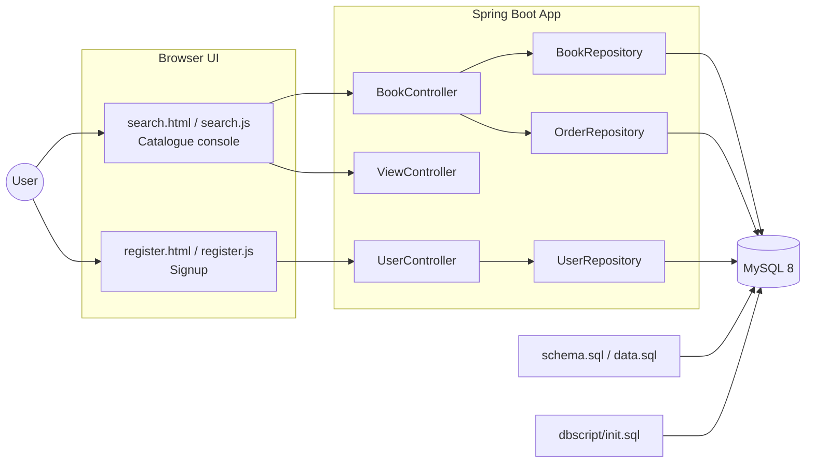

# Library Management System (LMS)

Lightweight Spring Boot + MySQL application with a pure HTML/CSS/vanilla JS UI for managing library inventory and bookings.

## Features
- Browse/search books (client-side pagination)
- Add new books in bulk
- Delete books in bulk
- Borrow a book
- Cancel/return a booking
- Inventory count
- User registration

## Tech Stack
- Backend: Spring Boot 2.2.x, Spring Data JPA
- Database: MySQL 8 (Docker via `docker-compose.yml`)
- Frontend: Static HTML/CSS + vanilla JS (no Angular/Vue)
- Packaging: WAR; runs via `spring-boot:run`

## Quick Start
Prereqs: Docker + Docker Compose, Java 8+, Maven (or `./mvnw`)

```bash
./run_local.sh
```
- Starts MySQL 8 in Docker (`lms`, root/root) seeded from `dbscript/init.sql` and `schema.sql`/`data.sql`.
- Starts the Spring Boot app on port 8080.

Open:
- Catalogue console: http://localhost:8080/views/search.html
- Registration: http://localhost:8080/views/register.html

Reset DB (drops volume): `docker-compose down -v`

## UI Flows
1) Browse: default mode shows paged books (ISBN/title/cover/publisher/pages/available).
2) Inventory count: select “Inventory snapshot” to see total books.
3) Add books: “Add new titles”, fill required fields (ISBN≥5, title≥3, pages>0, available≥0), add/remove rows, submit; list refreshes.
4) Delete: “Delete existing”, check rows, “Delete selected”; list refreshes.
5) Borrow: “Book now”, click “Book this title”; bookings refresh.
6) Cancel booking: “Cancel booking”, click “Cancel order”; bookings refresh.
7) Register: fill all fields (passwords must match), submit; inline success/error shown.

## APIs
- GET `/api/getBooks`
- POST `/api/addBook` (bulk; validates ISBN≥5, title≥3, pages>0, available≥0)
- POST `/api/delBook`
- POST `/api/makeBooking`
- POST `/api/cancelBooking`
- GET `/api/getBookingDetails`
- GET `/api/count`
- POST `/user/register`

## Validation
- Books: ISBN≥5 chars, title≥3 chars, pages>0, available≥0; rejected with 400 + message.
- Registration: all fields required; passwords must match; server returns 400 on invalid payload.

## Project Layout
- `src/main/java/com/lms/demo/controller`: BookController, UserController, ViewController
- `src/main/java/com/lms/demo/data/model`: Book, Order, User
- `src/main/java/com/lms/demo/data/repository`: BookRepository, OrderRepository, UserRepository
- `src/main/java/com/lms/demo/dto`: CancelBookingRequest, UserDto
- `src/main/resources/static/views`: `search.html`, `register.html`
- `src/main/resources/static/js`: `search.js`, `register.js`
- `src/main/resources`: `application.properties`, `schema.sql`, `data.sql`
- `dbscript/init.sql`: Docker DB seed
- `docker-compose.yml`, `run_local.sh`

## Architecture (high level)

- Browser UI  
  - `search.html` + `search.js` (catalogue console, pagination, CRUD via REST)  
  - `register.html` + `register.js` (user signup)
- Spring Boot App  
  - Controllers: `BookController`, `UserController`, `ViewController`  
  - Repositories: `BookRepository`, `OrderRepository`, `UserRepository`  
  - Models/DTOs: `Book`, `Order`, `User`, `CancelBookingRequest`, `UserDto`
- MySQL 8 (Docker)  
  - `schema.sql` / `data.sql` (classpath init)  
  - `dbscript/init.sql` (Docker init)

### UML (context diagram)
GitHub/Markdown-friendly mermaid:



## Troubleshooting
- Port 3306 busy: change port mapping in `docker-compose.yml` and JDBC URL in `application.properties`.
- Permissions on Docker socket: run compose with sudo or adjust Docker permissions.
- Empty data after reset: run `docker-compose down -v` then `./run_local.sh` to re-seed.
